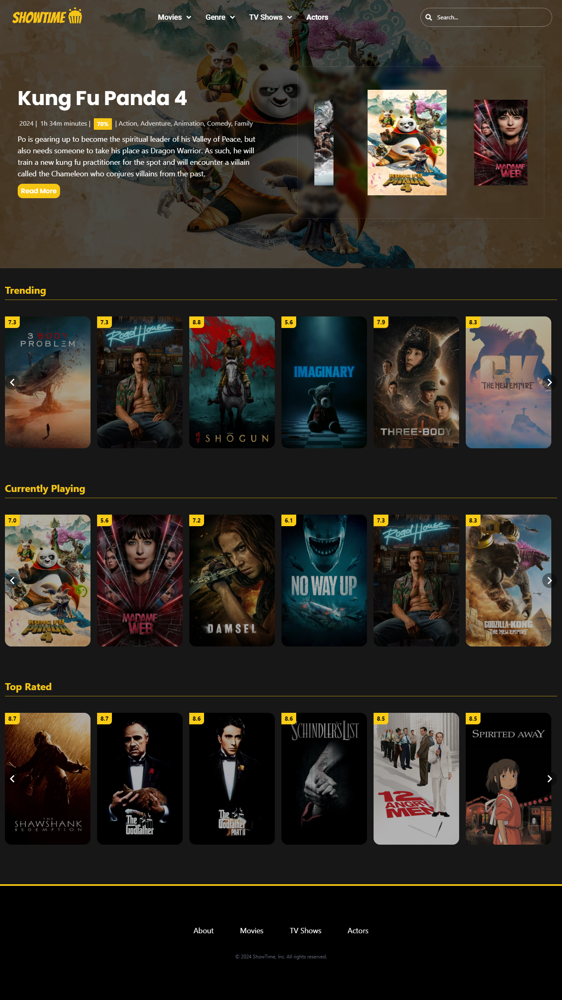
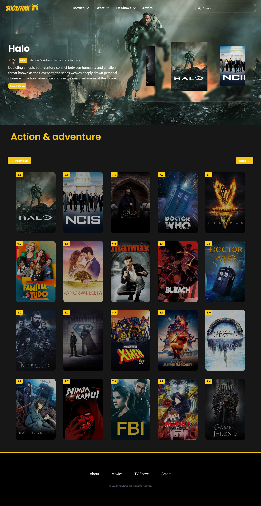

# Movie Project

## Overview

Working with APIs to make our websites interactive sits at the core of frontend web development. At the end, frontend websites work as interfaces that give us the ability to interace with data. All this data is coming from some form of an API.

## Screen shots
-   Landing page 
 
- TV shows landing page

## Links
- [Website link](https://movie-project-showtime-gg8g.vercel.app/)

## Tools used 
- nextjs
- react-icons
- react-multi-carousel
- headless UI React
- TailwindCSS

## ShowTime Team

-   #### Elaf, Ninos, Nooralhussein and Afyaa
